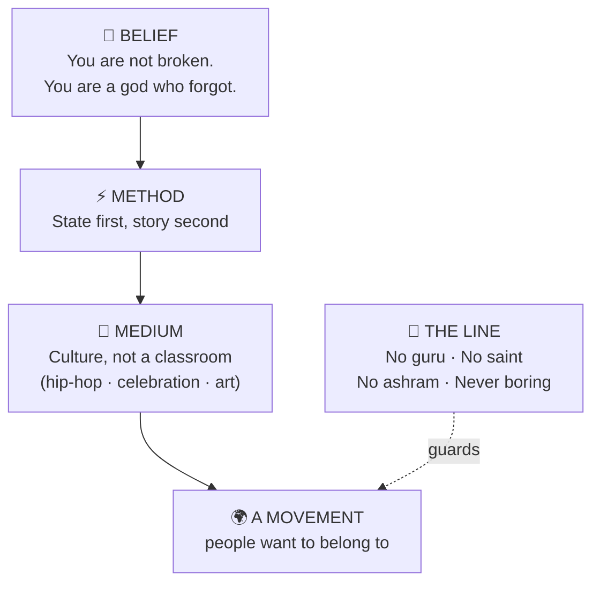
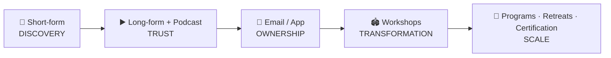

# The Movement — Visual Map

> One page. Everything in the folder, as pictures. For detail, follow the links.
> `vision/vision.md` · `strategy/go-to-market.md` · `strategy/resources-and-investment.md` · `strategy/competitive-landscape.md`

---

## 1. The whole idea in one picture



---

## 2. The archetype blend (take this, leave that)

| Source | ✅ Take | ❌ Leave |
|---|---|---|
| 🪈 **Krishna** | play, joy, devotion that dances | the altar / distance |
| 🧘 **Buddha** | interiority, attention science | renunciation, "desire = suffering" |
| 🔥 **Osho** | ecstatic + sexual + meditation tech | ashram, robes, cult |
| 🔨 **Nietzsche** | "become who you are," life-affirmation | bleakness, isolation |
| 🎵 **Kanye / hip-hop** | audacity, aesthetics, "I am a god" | chaos, cruelty |
| 🎤 **Tony Robbins** | live state-change machine, rigor | corporate sheen, no soul |

> **The moat = all four at once:** Osho-grade embodiment + Tony-grade live method + real devotion + hip-hop culture. Each rival has one or two. You'd have all four.

---

## 3. The method engine

```
   CHANGE STATE              →   STORY REWRITES        →   INSTALL IDENTITY    →   CELEBRATE
   (body / breath /              (old story can't            (new self, while         (dance it into
    sound / sex / strength)       hold the new state)         the door is open)         permanence)
```

### The signature framework — **The 5 Fires** 🔥

```
 1. BREATH    🌬️   the body's remote control
 2. SOUND     🗣️   your own voice as release + power
 3. BODY      💪   care for + command the vessel
 4. SEX       ❤️‍🔥   life-force, reclaimed without shame
 5. DEVOTION  🙏   prayer + Krishna/Ram as case studies
 ─────────────────────────────────────────────────────
 + CELEBRATION 🎉  the meta-practice through all five
```

---

## 4. Go-to-market — the funnel



### The 5 phases (don't skip — each is soil for the next)

| Phase | When | Goal | Move on when… |
|---|---|---|---|
| **0 · Foundation** | Wk 1–8 | name + kit + practice | message doc done, 4 wks practiced |
| **1 · Content engine** | Mo 1–12 | build the face | 6 mo consistent, format that works |
| **2 · Own audience** | Mo 6–18 | viewers → students | 1k list + first paid cohort w/ proof |
| **3 · In-person** | Mo 12–30 | irreplaceable change | repeatable sold-out workshops |
| **4 · Scale + culture** | Yr 2–4+ | person → movement | (ongoing) |

> Weekly loop: **1 long piece → 5–15 shorts.** Watch *saves & shares*, not likes.

---

## 5. Investment — the honest tiers

```
 LEAN      $3k–8k start · ~$1k/mo   →  proves the message · gets you to Phase 3
 SERIOUS   $30k–80k / yr            →  editor + producer + events (funded by revenue)
 EMPIRE    $200k–1M+ / yr           →  team + app + certification (funded by business)
```

**Hire in this order:** editor → producer → community/ops → event producer → facilitators → marketing lead.

**Reality check ⏳:** 2–4 years to "well-known." Most quit in the unpaid, ignored first 9 months. The one trait of those who make it: *they didn't stop posting.*

**Spend wisely**

| 💚 High-leverage | 🚫 Overrated early |
|---|---|
| good editor | expensive gear |
| liability insurance + legal | high-production studio video |
| event production (once people show up) | custom app before manual version sells |

---

## 6. The competitive map — your open lane

```
                    EMBODIED + CULTURE
                          ▲
                          │     ⭐ YOU
            Osho(legacy)  │   (the open lane)
            Tony Robbins  │   Aubrey Marcus
                          │   Joe Dispenza
   GURU / SAINT ◄─────────┼─────────► CATALYST / ARTIST
            Sadhguru      │   Prince Ea
            Jay Shetty    │   Eric Thomas
                          │
                          ▼
                    TALK / INSIGHT
```

| Competitor | Learn | Gap to exploit |
|---|---|---|
| **Aubrey Marcus** ⭐closest | fellowship + podcast + empire | bro/psychedelic/US — no joy, devotion, hip-hop |
| **Joe Dispenza** | workshops + certification scale | clinical, no culture, no celebration |
| **Prince Ea** | viral short-form + hip-hop | content creator, light on method/practice |
| **Eric Thomas** | hip-hop energy + raw delivery | pure hustle, no depth/meditation/joy |
| **Osho** 👻ancestor | the whole embodied method | dead, buried under cult mythology |
| **Sadhguru / Jay Shetty** | distribution machine | they ARE the guru/saint you reject |

> **One-line pitch:** *"Osho's methods for the hip-hop generation — without the ashram and without the cult."*

---

## 7. Open decisions (yours) 🎯

```
 [ ] 1. Name the movement        (placeholder folder = "the-movement")
 [ ] 2. Lock the 5 Fires framework
 [ ] 3. Confirm starting budget tier
```

---

*Detail lives in the four source docs. This page is the map, not the territory.*
